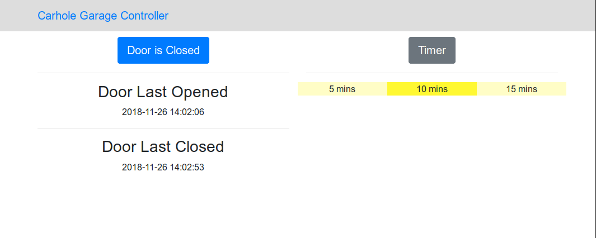
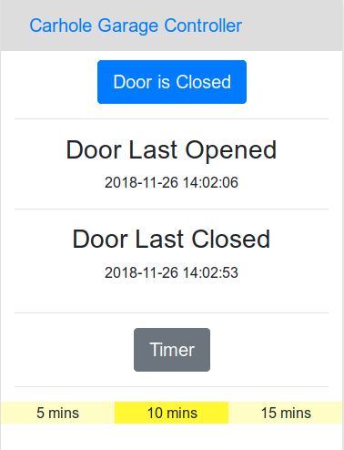
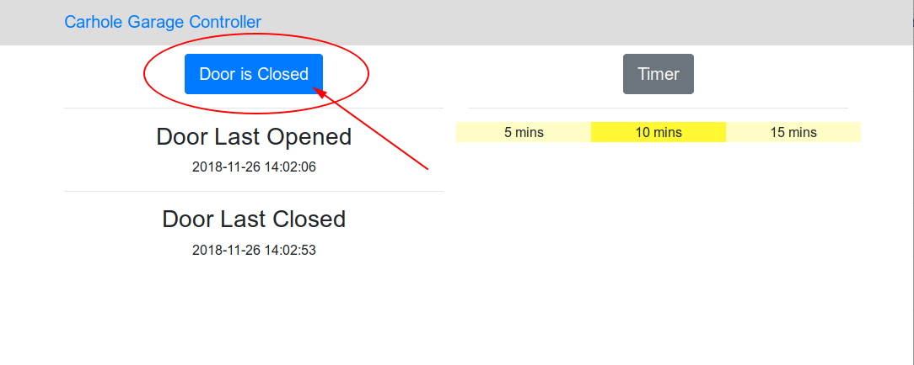
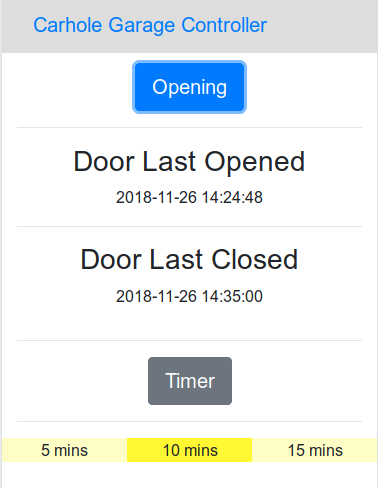
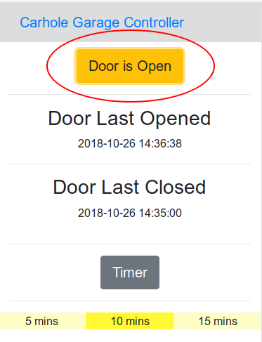
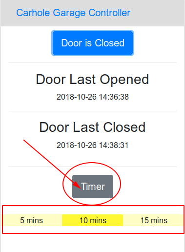
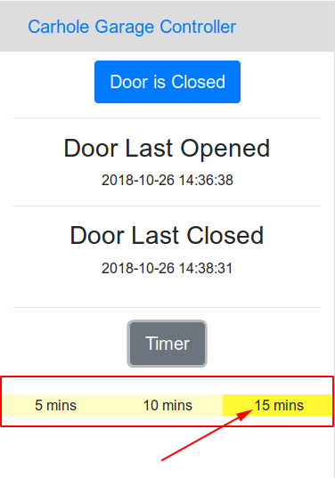

# Carhole Web

Carhole is a home-built garage door control system.  More details about the physical device and build can be found in [this blog post](https://thelurkingvariable.com/2018/06/19/a-garage-door-controller-based-on-a-raspberry-pi/).  It is designed with a Raspberry Pi in mind.  

This project allows a web front-end to be coupled with the existing [backend](https://github.com/abegosum/carhole_minder) backend system on the same device, allowing remote control of the garage door.  

 

## Prerequisites

To run the web front-end app, you need the following:

* Ruby >= 2.2.3
* Bundler
* A running instance of the [backend](https://github.com/abegosum/carhole_minder)

Optionally, you can run the application proxied by a web server, such as Apache or NGINX.  If you choose to do this, it's recommended that you run the application using Passenger.  How to set this up is beyond the scope of this README.

## Installation

* Clone the project into the `/opt` directory and chown the application files to be owned by the `pi` user and group
```bash
sudo chown -R pi:pi /opt/carhole_web
```
* Run bundle install to install all of the necessary dependencies
```bash
cd /opt/carhole_web
bundle install
```
* Precompile the static assets for use in the production environment
```bash
RAILS_ENV=production rails assets:precompile
```
* Set up the application secret credentials
```bash
EDITOR=vim rails credentials:edit
```
* Test the server by starting puma and visiting port 8080 of your device in your browser (if your device is on IP `192.168.1.2` use `http://192.168.1.2:8080`, for example)
```bash
bundle exec puma -b tcp://0.0.0.0:8080 -e production
```
* Press CTRL-C to quit puma
* Copy the systemd unit file to the systemd directory
```bash
sudo cp /opt/carhole_web/carhole_web.service /etc/systemd/system
```
* Use systemctl to start the service and test the app in your browser again (note that there may be a delay between the return of this command and when the app is available; give it 60 seconds to be sure)
```bash
sudo systemctl start carhole_web.service
```
* (Optional) Use systemctl to enable the service to start on boot
```bash
sudo systemctl enable carhole_web.service
```

## Usage

### Opening or Closing the Garage Door

To open or close the garage door, click the blue or yellow button reporting the garage door status.

 ->  -> 

### Changing the Timer Setting

To cycle through the timer settings, click the grey timer button.

 -> 
