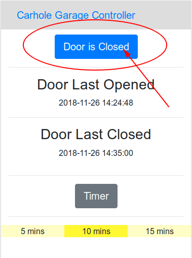

# Carhole Web

Carhole is a home-built garage door control system.  More details about the physical device and build can be found in [this blog post](https://thelurkingvariable.com/2018/06/19/a-garage-door-controller-based-on-a-raspberry-pi/).  It is designed with a Raspberry Pi in mind.  

This project allows a web front-end to be coupled with the existing [backend](https://github.com/abegosum/carhole_minder) backend system on the same device, allowing remote control of the garage door.  

 

## Prerequisites

To run the web front-end app, you need the following:

* Ruby >= 2.2.3
* Bundler
* A running instance of the [backend](https://github.com/abegosum/carhole_minder)

Optionally, you can run the application proxied by a web server, such as Apache or NGINX.  If you choose to do this, it's recommended that you run the application using Passenger.  How to set this up is beyond the scope of this README.

## Installation

* Clone the project into the `/opt` directory and chown the application files to be owned by the `pi` user and group
```bash
sudo chown -R pi:pi /opt/carhole_web
```
* Run bundle install to install all of the necessary dependencies
```bash
cd /opt/carhole_web
bundle install --path=vendor/bundle
```
* Precompile the static assets for use in the production environment
```bash
RAILS_ENV=production rails assets:precompile
```
* Set up the application secret credentials
```bash
EDITOR=vim rails credentials:edit
```
* Test the server by starting puma and visiting port 8080 of your device in your browser (if your device is on IP `192.168.1.2` use `http://192.168.1.2:8080`, for example)
```bash
bundle exec puma -b tcp://0.0.0.0:8080 -e production
```
* Press CTRL-C to quit puma
* Copy the systemd unit file to the systemd directory
```bash
sudo cp /opt/carhole_web/carhole_web.service /etc/systemd/system
```
* Use systemctl to start the service and test the app in your browser again (note that there may be a delay between the return of this command and when the app is available; give it 60 seconds to be sure)
```bash
sudo systemctl start carhole_web.service
```
* (Optional) Use systemctl to enable the service to start on boot
```bash
sudo systemctl enable carhole_web.service
```

## Usage

### Opening or Closing the Garage Door

To open or close the garage door, click the blue or yellow button reporting the garage door status.

 ->  -> 

### Changing the Timer Setting

To cycle through the timer settings, click the grey timer button.

 -> 

## REST Service

Two endpoints are available for consumption by REST clients.  One provides a single method to gather data about the state of the garage door, the other provides two methods where the client can change state by issuing HTTP PUT requests.

### `/garage_status/view.json` (`GET`)

This endpoint and method provides all the data available in the UI of the application as a JSON object with the following members:

* `door_is_open` - a boolean stating whether the door is currently open
* `door_last_opened_time` - an integer representing a Unix timestamp of the last time the garage door was opened
* `door_last_closed_time` - an integer representing a Unix timestamp of the last time the garage door was closed
* `available_timer_settings` - an array of integers, listing the possible timer settings (in minutes)
    * Note that this is configurable by changing constant values in the [backend](https://github.com/abegosum/carhole_minder)
* `selected_timer_index` - an integer representing an index of `available_timer_settings`; this is the currently selected timer setting
* `selected_timer_setting` - an integer representing the currently selected timer setting as a number of minutes

### `/garage_control` 

This endpoint provides two methods to alter garage system state.  These methods were designed to emulate the button presses on the unit, so they are simple `PUT` requests with no data arguments.

#### `/garage_control/open_close` (`PUT`)

Opens or closes the garage door and returns a String: `opening` if the door was closed before the request and `closing` if the door was opened before the request.

#### `/garage_control/timer_advance` (`PUT`)

Advances the timer to the next setting (or wraps round to the first if there are no settings left in the array).  Returns the index of the newly selected timer from the `available_timer_settings` (retrievable from `/garage_status/view.json` via `GET` request, see above).

## License

Copyright 2018 Aaron M. Bond

Licensed under the Apache License, Version 2.0 (the "License"); you may not use this file except in compliance with the License. You may obtain a copy of the License at

    http://www.apache.org/licenses/LICENSE-2.0

Unless required by applicable law or agreed to in writing, software distributed under the License is distributed on an "AS IS" BASIS, WITHOUT WARRANTIES OR CONDITIONS OF ANY KIND, either express or implied. See the License for the specific language governing permissions and limitations under the License.
